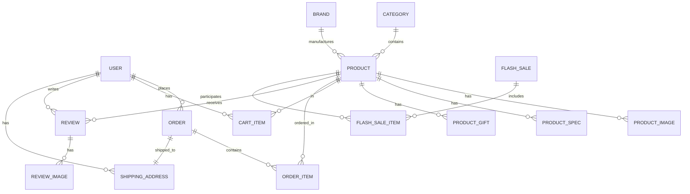

# LaptopVerse — Thiết kế CSDL & API chi tiết

> Tài liệu thiết kế Database Schema (PostgreSQL) và RESTful API cho hệ thống E-commerce bán Laptop **LaptopVerse**.
> Được trích xuất từ giao diện frontend (Next.js), nghiệp vụ, và mock data hiện có.

---

## Mục lục

1. [Tổng quan hệ thống](#1-tổng-quan-hệ-thống)
2. [Sơ đồ ERD](#2-sơ-đồ-erd)
3. [Chi tiết bảng CSDL](#3-chi-tiết-bảng-csdl)
4. [API Specification](#4-api-specification)
5. [Enum & Constants](#5-enum--constants)
6. [Business Rules](#6-business-rules)

---

## 1. Tổng quan hệ thống

### Các module nghiệp vụ

| Module | Mô tả | Trang FE tương ứng |
|--------|--------|---------------------|
| **Catalog** | Quản lý sản phẩm, danh mục, thương hiệu | `/laptops`, `/laptops/[id]` |
| **Cart** | Giỏ hàng (CRUD, chọn SP để checkout) | `/cart` |
| **Order** | Đặt hàng, thanh toán | `/checkout` |
| **Review** | Đánh giá sản phẩm | Trang chi tiết SP |
| **FlashSale** | Chương trình flash sale có đếm ngược | Trang chủ |
| **User** | Quản lý tài khoản (chưa có trên FE, cần cho API) | — |

---

## 2. Sơ đồ ERD



---

## 3. Chi tiết bảng CSDL

### 3.1. `users` — Người dùng

| Cột | Kiểu | Ràng buộc | Mô tả |
|-----|------|-----------|-------|
| `id` | `BIGSERIAL` | PK | ID người dùng |
| `email` | `VARCHAR(255)` | UNIQUE, NOT NULL | Email đăng nhập |
| `password_hash` | `VARCHAR(255)` | NOT NULL | Mật khẩu đã hash (BCrypt) |
| `full_name` | `VARCHAR(100)` | NOT NULL | Họ và tên |
| `phone` | `VARCHAR(15)` | UNIQUE | Số điện thoại (VD: `0912345678`) |
| `avatar_url` | `VARCHAR(500)` | | Ảnh đại diện |
| `role` | `VARCHAR(20)` | NOT NULL, DEFAULT `'CUSTOMER'` | `CUSTOMER`, `ADMIN` |
| `is_active` | `BOOLEAN` | DEFAULT `TRUE` | Tài khoản hoạt động |
| `created_at` | `TIMESTAMPTZ` | DEFAULT `NOW()` | Ngày tạo |
| `updated_at` | `TIMESTAMPTZ` | DEFAULT `NOW()` | Ngày cập nhật |

**Index:** `idx_users_email`, `idx_users_phone`

---

### 3.2. `categories` — Danh mục sản phẩm

> Tương ứng mock data: `Gaming`, `Văn phòng`, `Apple`

| Cột | Kiểu | Ràng buộc | Mô tả |
|-----|------|-----------|-------|
| `id` | `SERIAL` | PK | |
| `name` | `VARCHAR(50)` | UNIQUE, NOT NULL | Tên danh mục |
| `slug` | `VARCHAR(50)` | UNIQUE, NOT NULL | URL-friendly slug (`gaming`, `van-phong`, `apple`) |
| `icon` | `VARCHAR(50)` | | Tên icon Lucide (`Gamepad2`, `Briefcase`, `Laptop`) |
| `description` | `VARCHAR(255)` | | Mô tả ngắn |
| `display_order` | `INT` | DEFAULT `0` | Thứ tự hiển thị |
| `is_active` | `BOOLEAN` | DEFAULT `TRUE` | |
| `created_at` | `TIMESTAMPTZ` | DEFAULT `NOW()` | |

**Dữ liệu mẫu:**

```sql
INSERT INTO categories (name, slug, icon, description) VALUES
('Gaming', 'gaming', 'Gamepad2', 'Laptop gaming hiệu năng cao'),
('Văn phòng', 'van-phong', 'Briefcase', 'Laptop văn phòng cao cấp'),
('Apple', 'apple', 'Laptop', 'MacBook chính hãng');
```

---

### 3.3. `brands` — Thương hiệu

> Trích từ mock data: `Acer`, `Apple`, `ASUS`, `Dell`, `HP`, `Lenovo`, `MSI`, `Razer`

| Cột | Kiểu | Ràng buộc | Mô tả |
|-----|------|-----------|-------|
| `id` | `SERIAL` | PK | |
| `name` | `VARCHAR(50)` | UNIQUE, NOT NULL | Tên thương hiệu |
| `slug` | `VARCHAR(50)` | UNIQUE, NOT NULL | URL slug |
| `logo_url` | `VARCHAR(500)` | | Logo thương hiệu |
| `is_active` | `BOOLEAN` | DEFAULT `TRUE` | |

---

### 3.4. `products` — Sản phẩm (Bảng chính)

> Tương ứng interface `Product` trong `mockData.ts`

| Cột | Kiểu | Ràng buộc | Mô tả |
|-----|------|-----------|-------|
| `id` | `BIGSERIAL` | PK | |
| `name` | `VARCHAR(200)` | NOT NULL | Tên sản phẩm |
| `slug` | `VARCHAR(200)` | UNIQUE, NOT NULL | URL slug |
| `brand_id` | `INT` | FK → `brands.id`, NOT NULL | ID thương hiệu |
| `category_id` | `INT` | FK → `categories.id`, NOT NULL | ID danh mục |
| `price` | `BIGINT` | NOT NULL, CHECK `> 0` | Giá bán hiện tại (VNĐ) |
| `original_price` | `BIGINT` | NOT NULL, CHECK `>= price` | Giá gốc (VNĐ) |
| `image` | `VARCHAR(500)` | NOT NULL | Ảnh đại diện chính |
| `rating` | `DECIMAL(2,1)` | DEFAULT `0`, CHECK `0-5` | Điểm đánh giá trung bình |
| `review_count` | `INT` | DEFAULT `0` | Tổng số đánh giá |
| `sold_count` | `INT` | DEFAULT `0` | Số lượng đã bán |
| `badge` | `VARCHAR(10)` | | `Hot`, `New`, `Sale` hoặc `NULL` |
| `specs` | `JSONB` | NOT NULL | Thông số cơ bản `{cpu, ram, storage, display}` |
| `description` | `TEXT` | | Mô tả dài |
| `stock_quantity` | `INT` | DEFAULT `0`, CHECK `>= 0` | Số lượng tồn kho |
| `is_active` | `BOOLEAN` | DEFAULT `TRUE` | Còn bán hay không |
| `created_at` | `TIMESTAMPTZ` | DEFAULT `NOW()` | |
| `updated_at` | `TIMESTAMPTZ` | DEFAULT `NOW()` | |

**JSONB `specs` cấu trúc:**

```json
{
  "cpu": "Intel Core i9-14900HX",
  "ram": "32GB DDR5",
  "storage": "1TB SSD NVMe",
  "display": "16\" QHD+ 240Hz"
}
```

**Indexes:**

```sql
CREATE INDEX idx_products_brand ON products(brand_id);
CREATE INDEX idx_products_category ON products(category_id);
CREATE INDEX idx_products_price ON products(price);
CREATE INDEX idx_products_rating ON products(rating DESC);
CREATE INDEX idx_products_sold ON products(sold_count DESC);
CREATE INDEX idx_products_badge ON products(badge) WHERE badge IS NOT NULL;
CREATE INDEX idx_products_specs ON products USING GIN (specs);
```

---

### 3.5. `product_images` — Ảnh gallery sản phẩm

> Tương ứng trường `gallery[]` trong mock data

| Cột | Kiểu | Ràng buộc | Mô tả |
|-----|------|-----------|-------|
| `id` | `BIGSERIAL` | PK | |
| `product_id` | `BIGINT` | FK → `products.id`, ON DELETE CASCADE | |
| `image_url` | `VARCHAR(500)` | NOT NULL | URL ảnh |
| `display_order` | `INT` | DEFAULT `0` | Thứ tự hiển thị |
| `is_primary` | `BOOLEAN` | DEFAULT `FALSE` | Ảnh chính (= `products.image`) |

---

### 3.6. `product_specs` — Thông số kỹ thuật chi tiết

> Tương ứng trường `detailedSpecs[]` — mảng `{label, value}`

| Cột | Kiểu | Ràng buộc | Mô tả |
|-----|------|-----------|-------|
| `id` | `BIGSERIAL` | PK | |
| `product_id` | `BIGINT` | FK → `products.id`, ON DELETE CASCADE | |
| `label` | `VARCHAR(50)` | NOT NULL | Nhãn (VD: `CPU`, `GPU`, `RAM`, `Pin`) |
| `value` | `VARCHAR(255)` | NOT NULL | Giá trị chi tiết |
| `display_order` | `INT` | DEFAULT `0` | Thứ tự hiển thị |

**Ví dụ:** `("CPU", "Intel Core i9-14900HX (24 nhân, 5.8GHz Boost)")`

---

### 3.7. `product_gifts` — Quà tặng kèm sản phẩm

> Tương ứng trường `gifts[]`

| Cột | Kiểu | Ràng buộc | Mô tả |
|-----|------|-----------|-------|
| `id` | `BIGSERIAL` | PK | |
| `product_id` | `BIGINT` | FK → `products.id`, ON DELETE CASCADE | |
| `description` | `VARCHAR(255)` | NOT NULL | Mô tả quà tặng |
| `display_order` | `INT` | DEFAULT `0` | |
| `is_active` | `BOOLEAN` | DEFAULT `TRUE` | |

---

### 3.8. `flash_sales` — Chương trình Flash Sale

> FE: `FlashSale.tsx` — đếm ngược 8 tiếng

| Cột | Kiểu | Ràng buộc | Mô tả |
|-----|------|-----------|-------|
| `id` | `SERIAL` | PK | |
| `title` | `VARCHAR(100)` | NOT NULL | Tên chương trình |
| `start_time` | `TIMESTAMPTZ` | NOT NULL | Thời gian bắt đầu |
| `end_time` | `TIMESTAMPTZ` | NOT NULL, CHECK `> start_time` | Thời gian kết thúc |
| `is_active` | `BOOLEAN` | DEFAULT `TRUE` | |
| `created_at` | `TIMESTAMPTZ` | DEFAULT `NOW()` | |

---

### 3.9. `flash_sale_items` — SP tham gia Flash Sale

| Cột | Kiểu | Ràng buộc | Mô tả |
|-----|------|-----------|-------|
| `id` | `BIGSERIAL` | PK | |
| `flash_sale_id` | `INT` | FK → `flash_sales.id` | |
| `product_id` | `BIGINT` | FK → `products.id` | |
| `sale_price` | `BIGINT` | NOT NULL | Giá flash sale |
| `stock_limit` | `INT` | | Giới hạn SL flash sale |
| `sold_count` | `INT` | DEFAULT `0` | Đã bán trong flash sale |

**Unique constraint:** `(flash_sale_id, product_id)`

---

### 3.10. `cart_items` — Giỏ hàng

> Tương ứng `CartContext.tsx` — actions: ADD, REMOVE, UPDATE_QTY, CLEAR

| Cột | Kiểu | Ràng buộc | Mô tả |
|-----|------|-----------|-------|
| `id` | `BIGSERIAL` | PK | |
| `user_id` | `BIGINT` | FK → `users.id`, ON DELETE CASCADE | |
| `product_id` | `BIGINT` | FK → `products.id`, ON DELETE CASCADE | |
| `quantity` | `INT` | NOT NULL, CHECK `1-10` | Số lượng (max 10 theo logic FE) |
| `created_at` | `TIMESTAMPTZ` | DEFAULT `NOW()` | |
| `updated_at` | `TIMESTAMPTZ` | DEFAULT `NOW()` | |

**Unique constraint:** `(user_id, product_id)` — mỗi SP chỉ 1 dòng/giỏ

---

### 3.11. `shipping_addresses` — Địa chỉ giao hàng

> Tương ứng form checkout: fullName, phone, email, province, district, address

| Cột | Kiểu | Ràng buộc | Mô tả |
|-----|------|-----------|-------|
| `id` | `BIGSERIAL` | PK | |
| `user_id` | `BIGINT` | FK → `users.id` | |
| `full_name` | `VARCHAR(100)` | NOT NULL | Họ và tên người nhận |
| `phone` | `VARCHAR(15)` | NOT NULL | SĐT (regex: `^0[3-9]\d{8}$`) |
| `email` | `VARCHAR(255)` | | Email (không bắt buộc) |
| `province` | `VARCHAR(50)` | NOT NULL | Tỉnh/Thành phố |
| `district` | `VARCHAR(50)` | NOT NULL | Quận/Huyện |
| `address` | `VARCHAR(255)` | NOT NULL, CHECK `length >= 10` | Địa chỉ cụ thể |
| `is_default` | `BOOLEAN` | DEFAULT `FALSE` | Địa chỉ mặc định |
| `created_at` | `TIMESTAMPTZ` | DEFAULT `NOW()` | |

---

### 3.12. `orders` — Đơn hàng

> Tương ứng checkout flow: đặt hàng → hiển thị mã đơn `LV-XXXXXXXX`

| Cột | Kiểu | Ràng buộc | Mô tả |
|-----|------|-----------|-------|
| `id` | `BIGSERIAL` | PK | |
| `order_code` | `VARCHAR(20)` | UNIQUE, NOT NULL | Mã đơn hàng (`LV-XXXXXXXX`) |
| `user_id` | `BIGINT` | FK → `users.id` | |
| `shipping_address_id` | `BIGINT` | FK → `shipping_addresses.id` | |
| `subtotal` | `BIGINT` | NOT NULL | Tạm tính (tổng giá SP) |
| `shipping_fee` | `BIGINT` | NOT NULL, DEFAULT `0` | Phí vận chuyển |
| `total` | `BIGINT` | NOT NULL | Tổng cộng = `subtotal + shipping_fee` |
| `payment_method` | `VARCHAR(10)` | NOT NULL | `cod` hoặc `vnpay` |
| `payment_status` | `VARCHAR(20)` | NOT NULL, DEFAULT `'PENDING'` | `PENDING`, `PAID`, `FAILED`, `REFUNDED` |
| `order_status` | `VARCHAR(20)` | NOT NULL, DEFAULT `'PENDING'` | *(xem bảng Status bên dưới)* |
| `note` | `TEXT` | | Ghi chú đơn hàng |
| `created_at` | `TIMESTAMPTZ` | DEFAULT `NOW()` | |
| `updated_at` | `TIMESTAMPTZ` | DEFAULT `NOW()` | |

**Order Status flow:**

```
PENDING → CONFIRMED → PROCESSING → SHIPPING → DELIVERED → COMPLETED
                                                        ↘ CANCELLED
                                                        ↘ RETURNED
```

**Business rules từ FE:**
- `shipping_fee = 0` nếu `subtotal >= 20,000,000₫`, ngược lại `= 150,000₫`
- `order_code` format: `LV-` + 8 ký tự số

---

### 3.13. `order_items` — Chi tiết đơn hàng

| Cột | Kiểu | Ràng buộc | Mô tả |
|-----|------|-----------|-------|
| `id` | `BIGSERIAL` | PK | |
| `order_id` | `BIGINT` | FK → `orders.id`, ON DELETE CASCADE | |
| `product_id` | `BIGINT` | FK → `products.id` | |
| `product_name` | `VARCHAR(200)` | NOT NULL | Snapshot tên SP tại thời điểm mua |
| `product_image` | `VARCHAR(500)` | NOT NULL | Snapshot ảnh SP |
| `price` | `BIGINT` | NOT NULL | Giá tại thời điểm mua |
| `original_price` | `BIGINT` | NOT NULL | Giá gốc tại thời điểm mua |
| `quantity` | `INT` | NOT NULL, CHECK `1-10` | Số lượng |
| `subtotal` | `BIGINT` | NOT NULL | `= price × quantity` |

---

### 3.14. `reviews` — Đánh giá sản phẩm

> Tương ứng `reviewData.ts` interface `ProductReview`

| Cột | Kiểu | Ràng buộc | Mô tả |
|-----|------|-----------|-------|
| `id` | `BIGSERIAL` | PK | |
| `product_id` | `BIGINT` | FK → `products.id`, ON DELETE CASCADE | |
| `user_id` | `BIGINT` | FK → `users.id` | |
| `rating` | `INT` | NOT NULL, CHECK `1-5` | Số sao |
| `title` | `VARCHAR(200)` | NOT NULL | Tiêu đề đánh giá |
| `content` | `TEXT` | NOT NULL | Nội dung |
| `helpful_count` | `INT` | DEFAULT `0` | Số lượt "Hữu ích" |
| `is_verified` | `BOOLEAN` | DEFAULT `FALSE` | Đã mua hàng xác nhận |
| `is_active` | `BOOLEAN` | DEFAULT `TRUE` | Hiển thị / ẩn |
| `created_at` | `TIMESTAMPTZ` | DEFAULT `NOW()` | |

**Unique constraint:** `(product_id, user_id)` — mỗi user 1 review/SP

---

### 3.15. `review_images` — Ảnh đánh giá

> Tương ứng trường `images?[]` trong `ProductReview`

| Cột | Kiểu | Ràng buộc | Mô tả |
|-----|------|-----------|-------|
| `id` | `BIGSERIAL` | PK | |
| `review_id` | `BIGINT` | FK → `reviews.id`, ON DELETE CASCADE | |
| `image_url` | `VARCHAR(500)` | NOT NULL | URL ảnh |
| `display_order` | `INT` | DEFAULT `0` | |

---

## 4. API Specification

> Base URL: `/api/v1`
> Format: JSON
> Authentication: JWT Bearer Token (trừ các endpoint public)

### 4.1. Auth — Xác thực

#### `POST /api/v1/auth/register`

Đăng ký tài khoản mới.

**Request Body:**

```json
{
  "fullName": "Nguyễn Văn A",
  "email": "user@example.com",
  "phone": "0912345678",
  "password": "SecureP@ss123"
}
```

**Response `201`:**

```json
{
  "id": 1,
  "email": "user@example.com",
  "fullName": "Nguyễn Văn A",
  "phone": "0912345678",
  "role": "CUSTOMER",
  "token": "eyJhbGciOiJIUzI1NiIs..."
}
```

**Errors:** `400` (validation), `409` (email/phone đã tồn tại)

---

#### `POST /api/v1/auth/login`

Đăng nhập.

**Request Body:**

```json
{
  "email": "user@example.com",
  "password": "SecureP@ss123"
}
```

**Response `200`:**

```json
{
  "id": 1,
  "email": "user@example.com",
  "fullName": "Nguyễn Văn A",
  "role": "CUSTOMER",
  "token": "eyJhbGciOiJIUzI1NiIs..."
}
```

**Errors:** `401` (sai credentials)

---

#### `GET /api/v1/auth/me`

🔒 Lấy thông tin user hiện tại.

**Response `200`:**

```json
{
  "id": 1,
  "email": "user@example.com",
  "fullName": "Nguyễn Văn A",
  "phone": "0912345678",
  "avatarUrl": null,
  "role": "CUSTOMER"
}
```

---

### 4.2. Categories — Danh mục

#### `GET /api/v1/categories`

Public. Lấy tất cả danh mục đang hoạt động.

**Response `200`:**

```json
[
  {
    "id": 1,
    "name": "Gaming",
    "slug": "gaming",
    "icon": "Gamepad2",
    "description": "Laptop gaming hiệu năng cao",
    "productCount": 7
  },
  {
    "id": 2,
    "name": "Văn phòng",
    "slug": "van-phong",
    "icon": "Briefcase",
    "description": "Laptop văn phòng cao cấp",
    "productCount": 7
  },
  {
    "id": 3,
    "name": "Apple",
    "slug": "apple",
    "icon": "Laptop",
    "description": "MacBook chính hãng",
    "productCount": 4
  }
]
```

---

### 4.3. Brands — Thương hiệu

#### `GET /api/v1/brands`

Public. Lấy danh sách thương hiệu (dùng cho filter sidebar).

**Response `200`:**

```json
[
  { "id": 1, "name": "Acer", "slug": "acer", "productCount": 2 },
  { "id": 2, "name": "Apple", "slug": "apple", "productCount": 4 },
  { "id": 3, "name": "ASUS", "slug": "asus", "productCount": 3 }
]
```

---

### 4.4. Products — Sản phẩm ⭐

#### `GET /api/v1/products`

Public. Lấy danh sách sản phẩm — hỗ trợ **filter, sort, pagination**.

**Query Parameters:**

| Param | Kiểu | Mô tả | VD |
|-------|------|--------|----|
| `category` | `string` | Filter theo slug danh mục | `gaming` |
| `brand` | `string[]` | Filter theo tên brand (multi) | `brand=ASUS&brand=Dell` |
| `priceMin` | `number` | Giá tối thiểu | `30000000` |
| `priceMax` | `number` | Giá tối đa | `50000000` |
| `cpuFamily` | `string[]` | Filter dòng CPU | `cpuFamily=Intel Core i9` |
| `ram` | `string[]` | Filter RAM | `ram=32GB DDR5` |
| `badge` | `string` | Filter badge | `Hot`, `New`, `Sale` |
| `search` | `string` | Tìm kiếm theo tên | `MacBook` |
| `sortBy` | `string` | Sắp xếp | `popular`, `newest`, `price-asc`, `price-desc`, `rating` |
| `page` | `number` | Trang (1-indexed) | `1` |
| `size` | `number` | Số SP/trang (default: 18) | `18` |

**Response `200`:**

```json
{
  "content": [
    {
      "id": 1,
      "name": "ASUS ROG Strix G16 2024",
      "slug": "asus-rog-strix-g16-2024",
      "brand": "ASUS",
      "category": "Gaming",
      "price": 42990000,
      "originalPrice": 49990000,
      "discountPercent": 14,
      "image": "https://...",
      "rating": 4.8,
      "reviewCount": 234,
      "soldCount": 1520,
      "badge": "Hot",
      "specs": {
        "cpu": "Intel Core i9-14900HX",
        "ram": "32GB DDR5",
        "storage": "1TB SSD NVMe",
        "display": "16\" QHD+ 240Hz"
      }
    }
  ],
  "page": 1,
  "size": 18,
  "totalElements": 18,
  "totalPages": 1
}
```

---

#### `GET /api/v1/products/{id}`

Public. Lấy chi tiết sản phẩm (bao gồm gallery, specs chi tiết, gifts, reviews summary).

**Response `200`:**

```json
{
  "id": 1,
  "name": "ASUS ROG Strix G16 2024",
  "slug": "asus-rog-strix-g16-2024",
  "brand": { "id": 3, "name": "ASUS" },
  "category": { "id": 1, "name": "Gaming", "slug": "gaming" },
  "price": 42990000,
  "originalPrice": 49990000,
  "discountPercent": 14,
  "image": "https://...",
  "gallery": [
    "https://image1.jpg",
    "https://image2.jpg",
    "https://image3.jpg",
    "https://image4.jpg",
    "https://image5.jpg"
  ],
  "rating": 4.8,
  "reviewCount": 234,
  "soldCount": 1520,
  "badge": "Hot",
  "specs": {
    "cpu": "Intel Core i9-14900HX",
    "ram": "32GB DDR5",
    "storage": "1TB SSD NVMe",
    "display": "16\" QHD+ 240Hz"
  },
  "detailedSpecs": [
    { "label": "CPU", "value": "Intel Core i9-14900HX (24 nhân, 5.8GHz Boost)" },
    { "label": "GPU", "value": "NVIDIA GeForce RTX 4080 12GB GDDR6" },
    { "label": "RAM", "value": "32GB DDR5-5600MHz (2x16GB, tối đa 64GB)" },
    { "label": "Ổ cứng", "value": "1TB PCIe 4.0 NVMe SSD" },
    { "label": "Màn hình", "value": "16\" QHD+ (2560x1600) 240Hz, IPS, 3ms, 100% DCI-P3" },
    { "label": "Pin", "value": "90Wh | Sạc 240W" },
    { "label": "Hệ điều hành", "value": "Windows 11 Home" },
    { "label": "Trọng lượng", "value": "2.5 kg" }
  ],
  "description": "ASUS ROG Strix G16 2024 là chiếc laptop gaming đỉnh cao...",
  "gifts": [
    "Chuột gaming ASUS ROG Chakram X Origin trị giá 3.990.000đ",
    "Tai nghe ROG Delta S Core trị giá 1.990.000đ",
    "Balo ROG Ranger BP2702 trị giá 1.290.000đ",
    "Bảo hành VIP 1 đổi 1 trong 12 tháng đầu"
  ],
  "stockQuantity": 50,
  "isFlashSale": true
}
```

**Errors:** `404` (sản phẩm không tồn tại)

---

#### `GET /api/v1/products/{id}/related`

Public. Lấy sản phẩm liên quan (cùng category, khác ID).

**Query:** `limit` (default: 6)

**Response `200`:** Mảng `ProductListDTO[]` (cùng format với `GET /products` content items)

---

### 4.5. Flash Sale

#### `GET /api/v1/flash-sales/active`

Public. Lấy chương trình flash sale đang diễn ra.

**Response `200`:**

```json
{
  "id": 1,
  "title": "Flash Sale Cuối Tuần",
  "startTime": "2026-03-11T12:00:00+07:00",
  "endTime": "2026-03-11T20:00:00+07:00",
  "products": [
    {
      "id": 1,
      "name": "ASUS ROG Strix G16 2024",
      "price": 42990000,
      "originalPrice": 49990000,
      "image": "https://...",
      "rating": 4.8,
      "reviewCount": 234,
      "soldCount": 1520,
      "badge": "Hot",
      "specs": { "cpu": "...", "ram": "...", "storage": "...", "display": "..." },
      "flashSalePrice": 42990000,
      "stockLimit": 50,
      "flashSaleSold": 12
    }
  ]
}
```

**Errors:** `404` (không có flash sale đang chạy)

---

### 4.6. Cart — Giỏ hàng 🔒

> Tất cả endpoint cart yêu cầu đăng nhập (JWT).

#### `GET /api/v1/cart`

Lấy giỏ hàng của user hiện tại.

**Response `200`:**

```json
{
  "items": [
    {
      "id": 1,
      "product": {
        "id": 1,
        "name": "ASUS ROG Strix G16 2024",
        "price": 42990000,
        "originalPrice": 49990000,
        "image": "https://...",
        "specs": { "cpu": "...", "ram": "...", "storage": "...", "display": "..." },
        "stockQuantity": 50
      },
      "quantity": 2
    }
  ],
  "totalItems": 2,
  "totalPrice": 85980000
}
```

---

#### `POST /api/v1/cart/items`

Thêm sản phẩm vào giỏ hàng. Nếu đã tồn tại → tăng quantity +1 (max 10).

**Request Body:**

```json
{
  "productId": 1
}
```

**Response `200`:** Cart DTO (cùng format `GET /cart`)

**Errors:** `400` (quantity > 10), `404` (SP không tồn tại)

---

#### `PUT /api/v1/cart/items/{productId}`

Cập nhật số lượng. Nếu `quantity <= 0` → xóa item.

**Request Body:**

```json
{
  "quantity": 3
}
```

**Response `200`:** Cart DTO

**Errors:** `400` (quantity > 10), `404` (SP không có trong giỏ)

---

#### `DELETE /api/v1/cart/items/{productId}`

Xóa 1 SP khỏi giỏ.

**Response `204`:** No Content

---

#### `DELETE /api/v1/cart`

Xóa toàn bộ giỏ hàng (Clear cart).

**Response `204`:** No Content

---

### 4.7. Orders — Đặt hàng 🔒

#### `POST /api/v1/orders`

Tạo đơn hàng từ các SP đã chọn trong giỏ.

**Request Body:**

```json
{
  "items": [
    { "productId": 1, "quantity": 1 },
    { "productId": 4, "quantity": 2 }
  ],
  "shippingAddress": {
    "fullName": "Nguyễn Văn A",
    "phone": "0912345678",
    "email": "user@example.com",
    "province": "TP. Hồ Chí Minh",
    "district": "Quận 7",
    "address": "123 Nguyễn Văn Linh, Phường Tân Phú"
  },
  "paymentMethod": "cod",
  "note": "Giao giờ hành chính, gọi trước 30 phút"
}
```

**Response `201`:**

```json
{
  "id": 1,
  "orderCode": "LV-83927461",
  "subtotal": 134970000,
  "shippingFee": 0,
  "total": 134970000,
  "paymentMethod": "cod",
  "paymentStatus": "PENDING",
  "orderStatus": "PENDING",
  "note": "Giao giờ hành chính, gọi trước 30 phút",
  "items": [
    {
      "productId": 1,
      "productName": "ASUS ROG Strix G16 2024",
      "productImage": "https://...",
      "price": 42990000,
      "quantity": 1,
      "subtotal": 42990000
    },
    {
      "productId": 4,
      "productName": "Dell XPS 16 9640",
      "productImage": "https://...",
      "price": 45990000,
      "quantity": 2,
      "subtotal": 91980000
    }
  ],
  "shippingAddress": {
    "fullName": "Nguyễn Văn A",
    "phone": "0912345678",
    "province": "TP. Hồ Chí Minh",
    "district": "Quận 7",
    "address": "123 Nguyễn Văn Linh, Phường Tân Phú"
  },
  "createdAt": "2026-03-11T20:30:00+07:00"
}
```

**Business Rules:**
- `shippingFee = 0` nếu `subtotal >= 20,000,000₫`, ngược lại `150,000₫`
- Sau khi tạo đơn thành công → xóa các items đã đặt khỏi giỏ hàng
- Snapshot giá + tên SP vào `order_items` (giá tại thời điểm mua, không đổi)
- Giảm `stock_quantity` của SP tương ứng
- Tăng `sold_count` của SP tương ứng

**Validation:**
- `fullName`: bắt buộc, tối thiểu 3 ký tự
- `phone`: bắt buộc, regex `^0[3-9]\d{8}$`
- `email`: không bắt buộc, nếu có phải đúng format
- `province`: bắt buộc
- `district`: bắt buộc
- `address`: bắt buộc, tối thiểu 10 ký tự
- `paymentMethod`: `cod` hoặc `vnpay`

**Errors:** `400` (validation), `409` (hết hàng)

---

#### `GET /api/v1/orders`

🔒 Lấy danh sách đơn hàng của user.

**Query:** `page`, `size`, `status` (filter)

**Response `200`:**

```json
{
  "content": [
    {
      "id": 1,
      "orderCode": "LV-83927461",
      "total": 134970000,
      "orderStatus": "PENDING",
      "paymentMethod": "cod",
      "paymentStatus": "PENDING",
      "itemCount": 3,
      "createdAt": "2026-03-11T20:30:00+07:00"
    }
  ],
  "page": 1,
  "size": 10,
  "totalElements": 1,
  "totalPages": 1
}
```

---

#### `GET /api/v1/orders/{orderCode}`

🔒 Lấy chi tiết 1 đơn hàng.

**Response `200`:** Cùng format với response `POST /orders`

**Errors:** `404` (không tìm thấy), `403` (không phải đơn của user)

---

#### `PUT /api/v1/orders/{orderCode}/cancel`

🔒 Hủy đơn hàng (chỉ khi status = `PENDING` hoặc `CONFIRMED`).

**Response `200`:**

```json
{ "orderCode": "LV-83927461", "orderStatus": "CANCELLED" }
```

**Errors:** `400` (không thể hủy), `404`

---

### 4.8. Reviews — Đánh giá

#### `GET /api/v1/products/{productId}/reviews`

Public. Lấy đánh giá của sản phẩm.

**Query:** `page`, `size`, `sortBy` (`newest`, `helpful`, `rating-desc`, `rating-asc`)

**Response `200`:**

```json
{
  "summary": {
    "avgRating": 4.8,
    "totalReviews": 234,
    "distribution": { "5": 150, "4": 60, "3": 15, "2": 7, "1": 2 }
  },
  "content": [
    {
      "id": 1,
      "author": "Nguyễn Mạnh Hùng",
      "avatar": "NH",
      "rating": 5,
      "title": "Máy gaming quá đỉnh, đáng đồng tiền!",
      "content": "Sau 1 tháng sử dụng, mình thực sự hài lòng với ROG Strix G16...",
      "helpfulCount": 42,
      "isVerified": true,
      "images": [],
      "createdAt": "2026-02-28"
    }
  ],
  "page": 1,
  "size": 5,
  "totalElements": 5,
  "totalPages": 1
}
```

---

#### `POST /api/v1/products/{productId}/reviews`

🔒 Tạo đánh giá mới (chỉ khi đã mua SP).

**Request Body (multipart/form-data):**

| Field | Kiểu | Bắt buộc | Mô tả |
|-------|------|----------|-------|
| `rating` | `int` | ✅ | 1-5 |
| `title` | `string` | ✅ | Tiêu đề |
| `content` | `string` | ✅ | Nội dung |
| `images` | `File[]` | ❌ | Ảnh đính kèm (max 5) |

**Response `201`:** ReviewDTO

**Errors:** `400` (validation), `403` (chưa mua SP), `409` (đã review)

---

#### `POST /api/v1/reviews/{reviewId}/helpful`

🔒 Đánh dấu review là "Hữu ích".

**Response `200`:**

```json
{ "reviewId": 1, "helpfulCount": 43 }
```

---

### 4.9. Shipping Addresses 🔒

#### `GET /api/v1/addresses`

Lấy tất cả địa chỉ giao hàng của user.

**Response `200`:** `ShippingAddressDTO[]`

---

#### `POST /api/v1/addresses`

Thêm địa chỉ mới.

**Request Body:**

```json
{
  "fullName": "Nguyễn Văn A",
  "phone": "0912345678",
  "email": "user@example.com",
  "province": "TP. Hồ Chí Minh",
  "district": "Quận 7",
  "address": "123 Nguyễn Văn Linh, Phường Tân Phú",
  "isDefault": true
}
```

**Response `201`:** `ShippingAddressDTO`

---

#### `PUT /api/v1/addresses/{id}`

Cập nhật địa chỉ.

---

#### `DELETE /api/v1/addresses/{id}`

Xóa địa chỉ.

---

### 4.10. Admin APIs 🔐 (role = ADMIN)

| Method | Endpoint | Mô tả |
|--------|----------|-------|
| `POST` | `/api/v1/admin/products` | Tạo sản phẩm mới |
| `PUT` | `/api/v1/admin/products/{id}` | Cập nhật sản phẩm |
| `DELETE` | `/api/v1/admin/products/{id}` | Xóa (soft delete) sản phẩm |
| `POST` | `/api/v1/admin/categories` | Tạo danh mục |
| `PUT` | `/api/v1/admin/categories/{id}` | Cập nhật danh mục |
| `POST` | `/api/v1/admin/brands` | Tạo thương hiệu |
| `POST` | `/api/v1/admin/flash-sales` | Tạo chương trình flash sale |
| `PUT` | `/api/v1/admin/flash-sales/{id}` | Cập nhật flash sale |
| `GET` | `/api/v1/admin/orders` | Lấy tất cả đơn hàng (admin view) |
| `PUT` | `/api/v1/admin/orders/{orderCode}/status` | Cập nhật trạng thái đơn hàng |
| `GET` | `/api/v1/admin/dashboard/stats` | Thống kê: doanh thu, đơn hàng, SP bán chạy |

---

## 5. Enum & Constants

### Badge Types

```java
public enum Badge { Hot, New, Sale }
```

### Payment Methods

```java
public enum PaymentMethod { cod, vnpay }
```

### Payment Status

```java
public enum PaymentStatus { PENDING, PAID, FAILED, REFUNDED }
```

### Order Status

```java
public enum OrderStatus {
    PENDING,     // Chờ xác nhận
    CONFIRMED,   // Đã xác nhận
    PROCESSING,  // Đang xử lý
    SHIPPING,    // Đang giao hàng
    DELIVERED,   // Đã giao hàng
    COMPLETED,   // Hoàn thành
    CANCELLED,   // Đã hủy
    RETURNED     // Đã trả hàng
}
```

### User Roles

```java
public enum UserRole { CUSTOMER, ADMIN }
```

### Sort Options (Products)

```
popular    → ORDER BY sold_count DESC
newest     → ORDER BY id DESC (hoặc created_at DESC)
price-asc  → ORDER BY price ASC
price-desc → ORDER BY price DESC
rating     → ORDER BY rating DESC
```

### Price Ranges (Filter)

| Label | Min (VNĐ) | Max (VNĐ) |
|-------|-----------|-----------|
| Dưới 30 triệu | 0 | 30,000,000 |
| 30 - 50 triệu | 30,000,000 | 50,000,000 |
| 50 - 80 triệu | 50,000,000 | 80,000,000 |
| Trên 80 triệu | 80,000,000 | ∞ |

### Shipping Fee Rule

```
IF subtotal >= 20,000,000₫ THEN shippingFee = 0
ELSE shippingFee = 150,000₫
```

### CPU Families (Filter)

```
Intel Core i7, Intel Core i9, Intel Core Ultra, Apple M3, AMD Ryzen 9
```

### Provinces (Sample)

```
TP. Hồ Chí Minh, Hà Nội, Đà Nẵng, Cần Thơ, Hải Phòng,
An Giang, Bình Dương, Đồng Nai, Khánh Hòa, Long An
```

---

## 6. Business Rules

### 6.1. Giỏ hàng

| Rule | Mô tả |
|------|-------|
| Max quantity | Tối đa 10 SP cùng loại/giỏ hàng |
| Add duplicate | Nếu SP đã có → `quantity + 1` (không thêm dòng mới) |
| Update qty ≤ 0 | Xóa item khỏi giỏ |
| Clear cart | Xóa toàn bộ giỏ hàng |
| Persistence | Server-side (DB) khi đăng nhập, localStorage khi chưa đăng nhập |

### 6.2. Checkout

| Rule | Mô tả |
|------|-------|
| Selected items | Chỉ checkout các SP đã chọn (checkbox), không phải toàn bộ giỏ |
| Shipping fee | Miễn phí ship cho đơn ≥ 20 triệu VNĐ |
| Price snapshot | Giá SP snapshot tại thời điểm đặt hàng (không đổi theo giá hiện tại) |
| Post-order | Xóa SP đã đặt khỏi giỏ; tăng `sold_count`; giảm `stock_quantity` |
| Order code | Format `LV-XXXXXXXX` (8 chữ số ngẫu nhiên) |

### 6.3. Flash Sale

| Rule | Mô tả |
|------|-------|
| Time-based | Có `start_time` và `end_time` xác định |
| Stock limit | Giới hạn SL bán trong flash sale |
| Auto-expire | Hết thời gian → sản phẩm về giá bình thường |
| Countdown | FE hiển thị đồng hồ đếm ngược `HH:MM:SS` |

### 6.4. Reviews

| Rule | Mô tả |
|------|-------|
| One per product | Mỗi user chỉ 1 review/SP |
| Verified badge | `is_verified = TRUE` nếu user đã mua SP (có order COMPLETED) |
| Helpful vote | User đã đăng nhập có thể vote "Hữu ích" |
| Rating update | Khi thêm/xóa review → tính lại `products.rating` và `review_count` |

### 6.5. Products

| Rule | Mô tả |
|------|-------|
| Discount | `discountPercent = ROUND(((originalPrice - price) / originalPrice) × 100)` |
| Sorting | 5 options: Phổ biến, Mới nhất, Giá tăng dần, Giá giảm dần, Đánh giá |
| Filtering | 4 danh mục: Brand, Khoảng giá, Dòng CPU, RAM |
| Related | Cùng category, khác ID, limit 6 |

---

> 📅 Tài liệu tạo: 2026-03-11
> 🔗 Frontend repo: `dminhduc250136/PTIT_PTHTTMDT`
